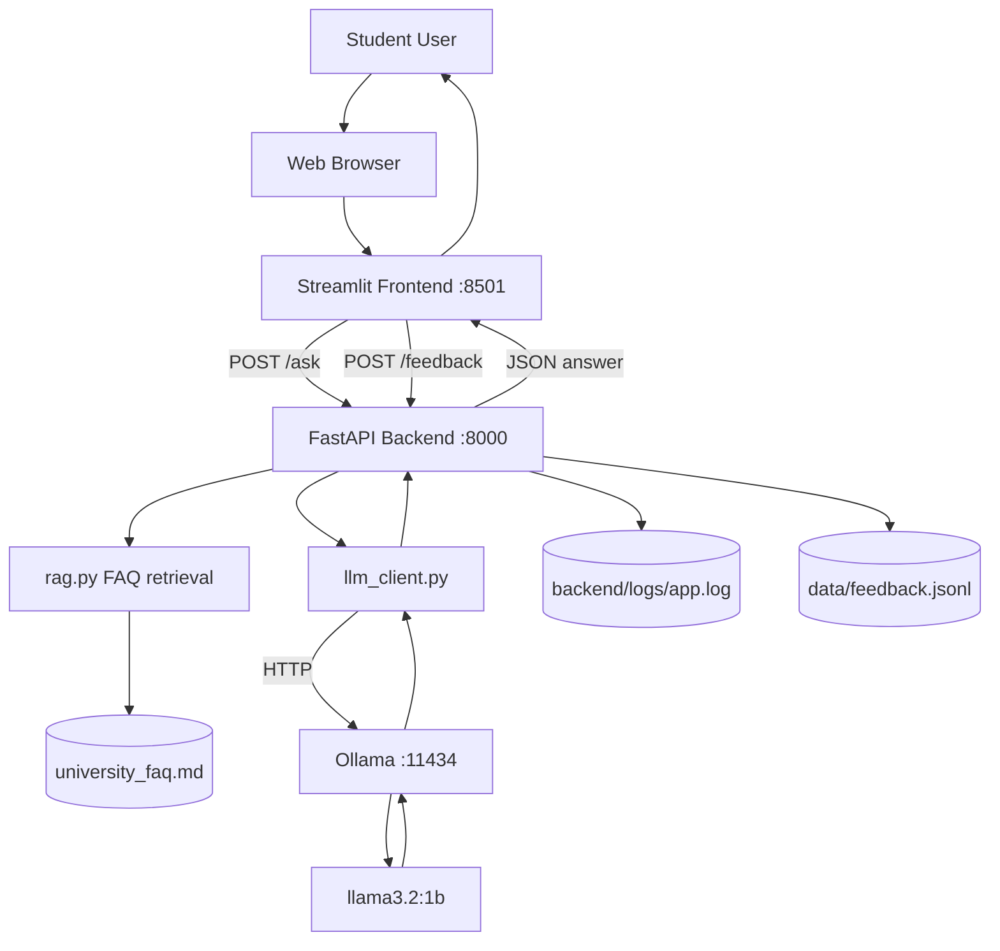
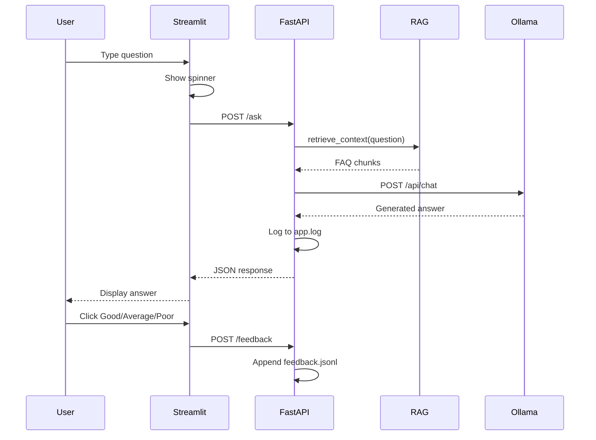

# UDSM Student Support LLM

**IS 365 Practical Assignment | University of Dar es Salaam | June 2026**

Charles J Tungaraza (2023-04-13490), Stella Thomas Kahungo (2023-04-03737), Godbless Kaaya (2023-04-03579), Baraka Jimmy Maengesho (2023-04-06473), Frank Elikana Wallace (2023-04-13642), Kelvin George Msuya (2023-04-08929)

A self-hosted LLM pipeline for a **UDSM Student Support Assistant**: students ask questions about university services and receive answers from a **local language model** (`llama3.2:1b` via Ollama), guided by a UDSM FAQ file and a structured system prompt.

---

## What this project does

| Feature | Description |
|---------|-------------|
| **Chat assistant** | Questions on UDSM registration, exams, library, ICT, hostel, fees, calendar, conduct |
| **Local LLM** | `llama3.2:1b` through Ollama — no cloud API keys |
| **FastAPI backend** | REST API, Swagger docs, validation, logging |
| **Streamlit frontend** | Web chat with spinner and error messages |
| **FAQ retrieval (RAG)** | Keyword search on `data/university_faq.md` before each answer |
| **Answer ratings** | Good / Average / Poor saved to `data/feedback.jsonl` |
| **Conversation history** | Last 3 turns sent to the model |
| **Streaming** | Token-by-token answers via `POST /ask/stream` |
| **Automated tests** | `pytest` for health, validation, prompts, feedback |
| **Logging** | Questions and answers in `backend/logs/app.log` |

---

## System architecture



### Request flow (one question)



---

## 8. Recommended project structure

```
student-support-llm/
├── backend/
│   ├── main.py
│   ├── llm_client.py
│   ├── config.py
│   ├── rag.py
│   └── logs/
│       └── app.log
├── frontend/
│   ├── app.py
│   └── docs_ui.py
├── data/
│   └── university_faq.md
├── tests/
│   └── test_api.py
├── docs/
│   ├── screenshots/
│   ├── submit_report.md
│   ├── submit_report.pdf
│   ├── submit_reflection.md
│   ├── submit_reflection.pdf
│   ├── architecture.md
│   ├── testing.md
│   ├── bonuses.md
│   ├── error_handling.md
│   ├── learning_outcomes.md
│   ├── prompt_comparison.md
│   ├── screenshots.md
│   └── screenshots/
├── requirements.txt
├── pytest.ini
├── run_backend.bat
├── run_frontend.bat
├── run_tests.bat
├── setup_ollama_env.bat
└── README.md
```

---

## Download from GitHub

```powershell
git clone https://github.com/johnboscocjt/Local-LLM-assignment.git
cd Local-LLM-assignment
```

---

## Prerequisites

| Requirement | Notes |
|-------------|-------|
| OS | Windows 10/11 |
| Python | 3.10+ |
| Ollama | https://ollama.com/download |
| RAM | 8 GB minimum |

---

## Installation

### Step 1 — Virtual environment

```powershell
python -m venv .venv
.\.venv\Scripts\Activate.ps1
pip install -r requirements.txt
```

### Step 2 — Ollama model

```powershell
ollama pull llama3.2:1b
ollama run llama3.2:1b "Hello from UDSM"
```

Optional on 8 GB RAM: run `setup_ollama_env.bat` before pulling the model.

### Step 3 — Verify

```powershell
pytest tests/ -v
```

---

## Running the application

Fastest way to start everything:

```powershell
.\run_all.bat
```

This starts Ollama first, waits for port 11434, then opens the backend and frontend in separate windows.

To stop everything:

```powershell
.\stop_all.bat
```

This closes Ollama, the backend, and the frontend.

| Terminal | Command | URL |
|----------|---------|-----|
| 1 — Ollama | `ollama serve` | port 11434 |
| 2 — Backend | `uvicorn backend.main:app --host 127.0.0.1 --port 8000` | http://127.0.0.1:8000/docs |
| 3 — Frontend | `streamlit run frontend/app.py` | http://localhost:8501 |

Or use `run_backend.bat` and `run_frontend.bat` separately if you want manual control.

Health check: http://127.0.0.1:8000/health

---

## Testing

```powershell
pytest tests/ -v
```

| Test | Checks |
|------|--------|
| `test_health_returns_ok` | `/health` responds |
| `test_ask_empty_question_returns_422` | Empty input rejected |
| `test_prompts_endpoint` | Prompt versions available |
| `test_feedback_saved` | Ratings saved |
| `test_ask_valid_question` | Full `/ask` with Ollama |

Manual test in Swagger (`/docs`) or Streamlit chat. Screenshot evidence is in `docs/screenshots/`.

---

## API reference

| Method | Endpoint | Description |
|--------|----------|-------------|
| GET | `/health` | Backend and Ollama status |
| POST | `/ask` | Ask a question |
| POST | `/ask/stream` | Stream answer (SSE) |
| POST | `/feedback` | Submit rating |
| GET | `/feedback/summary` | Rating counts |
| GET | `/prompts` | Prompt versions |

---

## Topics covered

1. Course registration (ARIS)
2. Examination rules
3. Library services
4. ICT support
5. Hostel application
6. Fee payment (GePG)
7. Academic calendar
8. Student conduct

---

## Error handling

| Situation | Behaviour |
|-----------|-----------|
| Backend not running | Frontend connection error message |
| Ollama not running | HTTP 503 from API |
| Empty question | HTTP 422 / UI warning |
| Slow response | Spinner while waiting |
| Timeout | HTTP 504 |

---

## Documentation

| File | Formats | Content |
|------|---------|---------|
| `submit_report` | `.md`, `.pdf` | Technical report |
| `submit_reflection` | `.md`, `.pdf` | Task 9 reflection |
| `architecture.md` | `.md` | System architecture |
| `testing.md` | `.md` | API testing evidence |
| `bonuses.md` | `.md` | Bonus features |
| `error_handling.md` | `.md` | Error handling |
| `learning_outcomes.md` | `.md` | Learning outcomes |
| `prompt_comparison.md` | `.md` | Prompt comparison |
| `screenshots/` | `.png`, `README.md` | Evidence 01–16 |

See `docs/README.md` for the full list.

---

## Troubleshooting

| Problem | Solution |
|---------|----------|
| `ollama` not found | Reinstall Ollama, restart terminal |
| HTTP 503 on `/ask` | Start Ollama and pull `llama3.2:1b` |
| Slow answers | Normal on CPU; wait up to 90 seconds |
| Port 8000 in use | Use `--port 8001` on uvicorn |

---

## Authors

**IS 365 | University of Dar es Salaam | June 2026**

Charles J Tungaraza, Stella Thomas Kahungo, Godbless Kaaya, Baraka Jimmy Maengesho, Frank Elikana Wallace, Kelvin George Msuya

---

## License

Educational project for IS 365 — University of Dar es Salaam.
