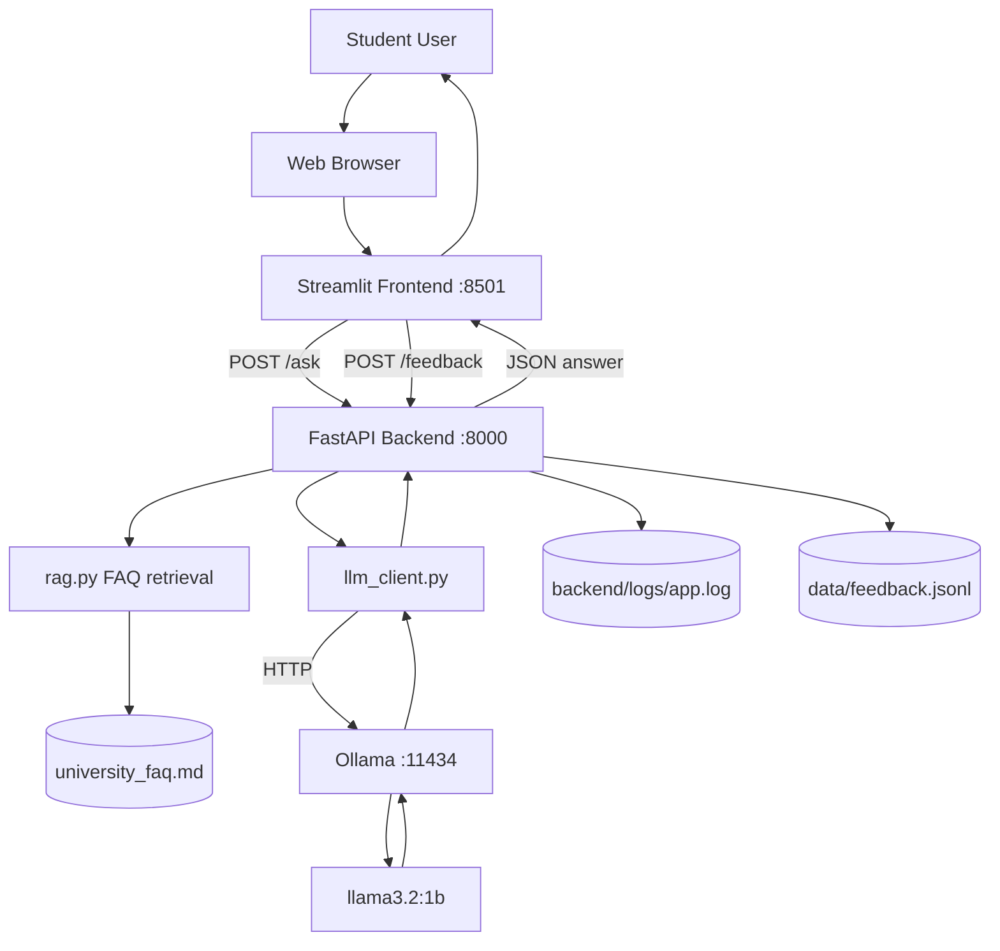
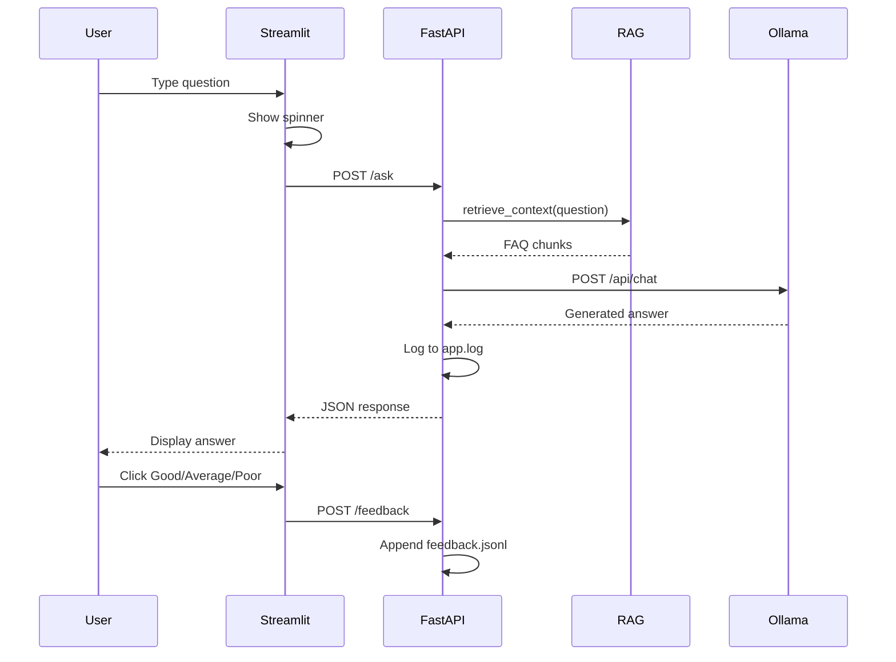

# System Architecture

**IS 365 | University of Dar es Salaam | June 2026**

Overview of how the UDSM Student Support Assistant is structured on a single laptop.

---

## Components

| Component | Location | Port | Role |
|-----------|----------|------|------|
| Streamlit frontend | `frontend/app.py` | 8501 | Chat UI for students |
| FastAPI backend | `backend/main.py` | 8000 | REST API, validation, logging |
| FAQ retrieval | `backend/rag.py` | — | Keyword search on `data/university_faq.md` |
| LLM client | `backend/llm_client.py` | — | HTTP calls to Ollama |
| Ollama + model | `llama3.2:1b` | 11434 | Local text generation |
| Logs | `backend/logs/app.log` | — | Questions, answers, errors |
| Feedback | `data/feedback.jsonl` | — | Good / Average / Poor ratings |

---

## System diagram

---

## Request flow (one question)

---

## Main API endpoints

| Method | Endpoint | Purpose |
|--------|----------|---------|
| GET | `/health` | Backend and Ollama status |
| POST | `/ask` | Ask a question (JSON response) |
| POST | `/ask/stream` | Stream answer (SSE) |
| POST | `/feedback` | Submit answer rating |
| GET | `/feedback/summary` | Rating counts |
| GET | `/prompts` | Available prompt versions |

Interactive docs: `http://127.0.0.1:8000/docs`

---

## Key source files

| File | Responsibility |
|------|----------------|
| `backend/main.py` | Routes, request models, error responses |
| `backend/llm_client.py` | Ollama HTTP client |
| `backend/rag.py` | FAQ keyword retrieval |
| `backend/config.py` | Model name, prompts, timeouts |
| `frontend/app.py` | Chat UI, sidebar options, ratings |
| `data/university_faq.md` | UDSM demo FAQ content |
| `tests/test_api.py` | Automated API tests |

---

## Screenshot evidence

| # | File | Shows |
|---|------|-------|
| 05 | `screenshots/05-fastapi-running.png` | Backend running |
| 06 | `screenshots/06-swagger-docs.png` | Swagger UI |
| 07 | `screenshots/07-health-response.png` | Health check JSON |
| 09 | `screenshots/09-frontend-home.png` | Streamlit UI |

---

## Related documents

| Document | Use |
|----------|-----|
| [submit_report.md](submit_report.md) | Full technical report |
| [learning_outcomes.md](learning_outcomes.md) | Outcome 3–5 evidence |
| [testing.md](testing.md) | API testing |
| [error_handling.md](error_handling.md) | Error paths |
| [bonuses.md](bonuses.md) | Streaming and history |
| [README.md](README.md) | Full docs index |
