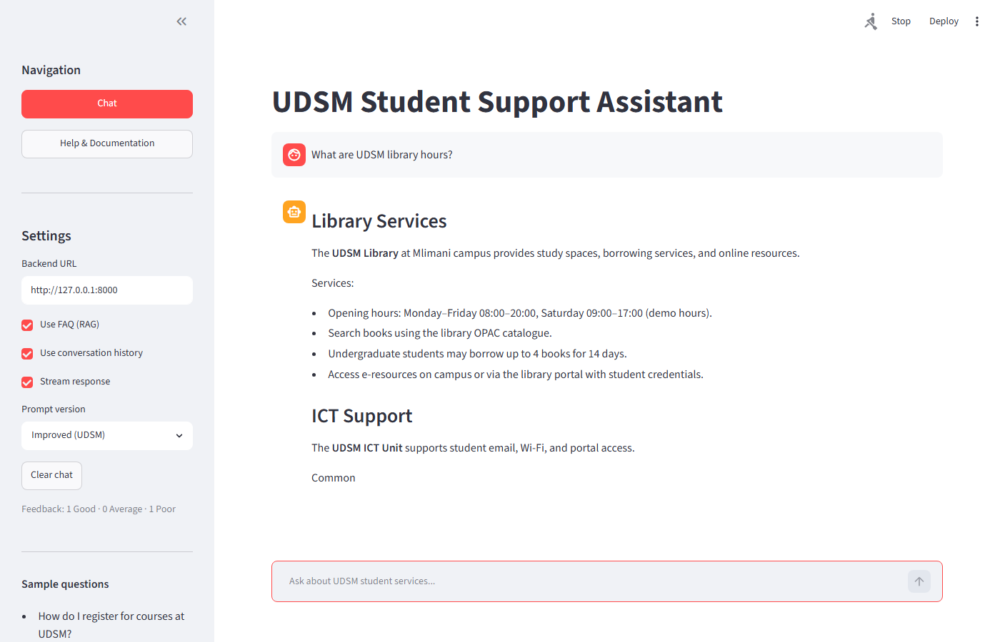
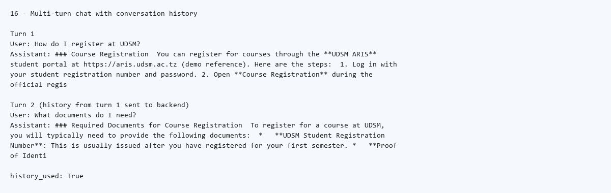

# Bonus Features (IS 365)

**IS 365 | University of Dar es Salaam | June 2026**

Bonus features implemented in this project. All run locally on 8 GB RAM.

## Summary

| Bonus | Feature | How to demo |
|-------|---------|-------------|
| **B** | FAQ RAG | Sidebar: enable **Use FAQ (RAG)**. Ask *How do I pay fees through GePG?* |
| **E** | Answer ratings | After an answer, click **Good**, **Average**, or **Poor** |
| **A** | Conversation history | Follow-up question with **Use conversation history** on |
| **D** | Streaming responses | Sidebar: **Stream response** — tokens appear gradually |
| **E+** | Feedback summary | Sidebar counts or `GET /feedback/summary` in Swagger |

**Not implemented:** Bonus C (Docker) — too heavy for 8 GB RAM laptop.

---

## Bonus B — Simple RAG

- **Code:** `backend/rag.py`, `data/university_faq.md`
- **API:** `POST /ask` with `"use_rag": true`
- **Demo:** Same question with RAG on vs off in Streamlit

## Bonus E — Response evaluation

- **Code:** `POST /feedback`, rating buttons in `frontend/app.py`
- **Storage:** `data/feedback.jsonl`
- **Demo:** Rate an answer, then `GET /feedback/summary`

## Bonus A — Multi-turn conversation

- **Code:** `history` field on `POST /ask` and `POST /ask/stream`
- **Limit:** Last 3 turns (6 messages)
- **Demo:** Register question, then *What documents do I need?*

## Bonus D — Streaming

- **Code:** `POST /ask/stream` (Server-Sent Events)
- **Frontend:** **Stream response** + `st.write_stream()`

```powershell
curl -N -X POST http://127.0.0.1:8000/ask/stream ^
  -H "Content-Type: application/json" ^
  -d "{\"question\":\"What are UDSM library hours?\",\"use_rag\":true}"
```

## Feedback summary (extends Bonus E)

- **Endpoint:** `GET /feedback/summary`
- **Returns:** `{ "total", "Good", "Average", "Poor" }`

---

## Screenshot evidence

**Bonus D — Streaming**



**Bonus A — Conversation history**



---

## Related documents

| Document | Use |
|----------|-----|
| [architecture.md](architecture.md) | System components |
| [learning_outcomes.md](learning_outcomes.md) | Outcome 5 — pipeline |
| [error_handling.md](error_handling.md) | Error handling |
| [testing.md](testing.md) | API tests |
| [README.md](README.md) | Full docs index |
