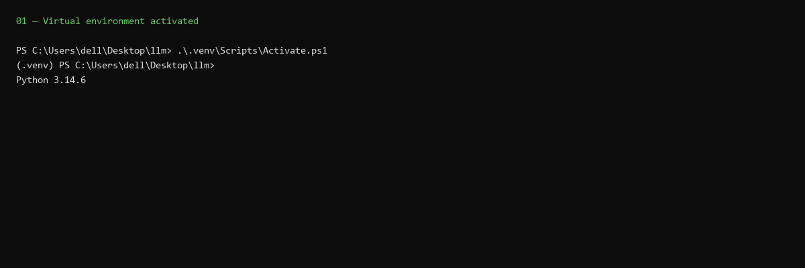
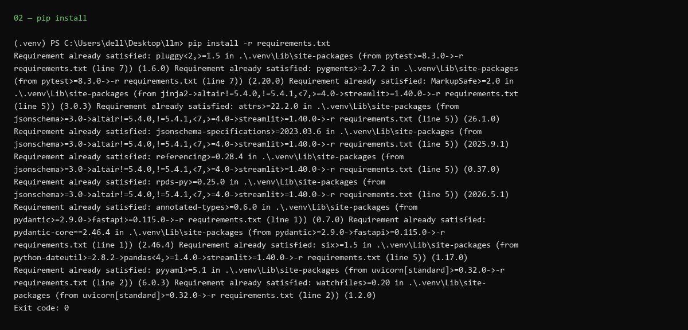
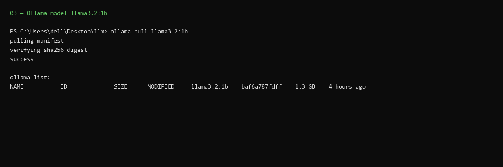
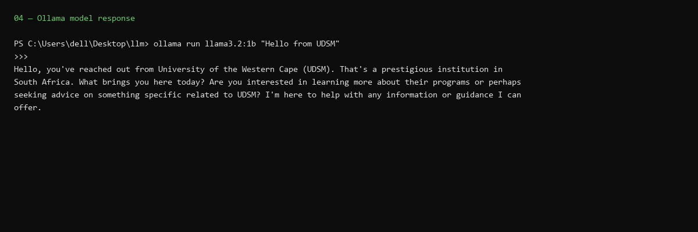
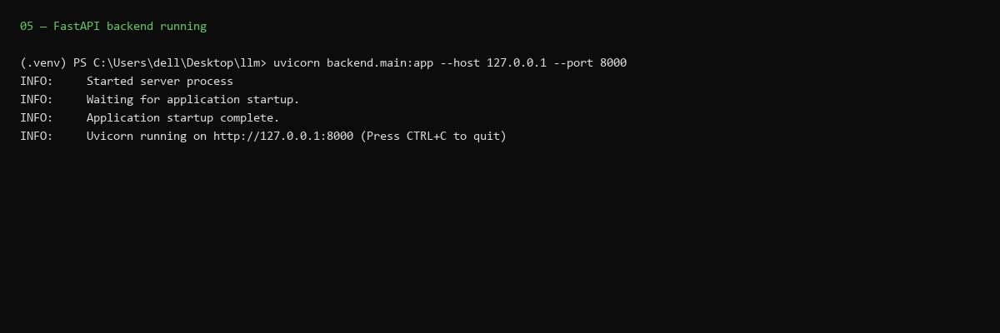
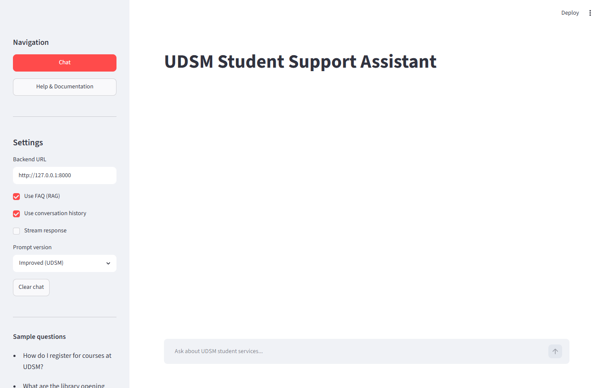
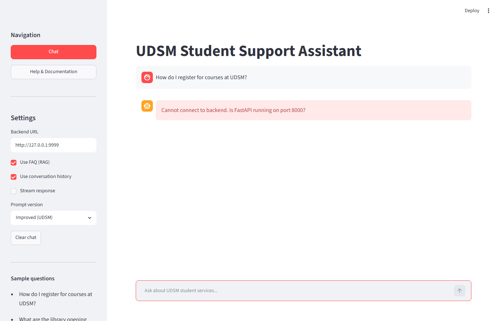
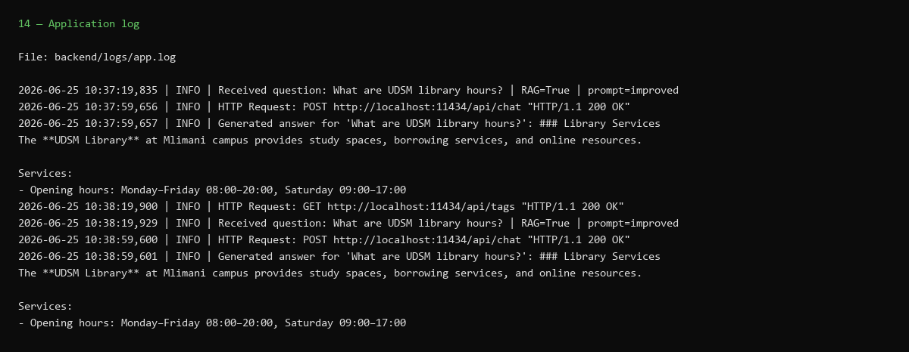

# Learning Outcomes — IS 365 Assignment

**IS 365 | University of Dar es Salaam | June 2026**

This document maps each course outcome to what we built and where the evidence is.

---

## Outcome 1: Prepare a local development environment for an AI application

**What it means:** Set up Python, virtual environment, and dependencies so the project runs reproducibly on your machine.

**How we achieved it:**

- Created Python venv: `.venv`
- Installed packages from `requirements.txt` (FastAPI, Streamlit, httpx, pytest)
- Low-RAM Ollama settings via `setup_ollama_env.bat`

**Evidence:** `README.md` Installation section; screenshots below.





---

## Outcome 2: Install and run a local LLM

**What it means:** Install Ollama, pull a model, and verify it generates text on your PC without cloud APIs.

**How we achieved it:**

- Installed Ollama for Windows
- Pulled `llama3.2:1b` (fallback: `smollm2:360m` in `backend/config.py`)
- Model served at `http://localhost:11434`

**Evidence:** `backend/config.py` → `MODEL_NAME`; screenshots below.





---

## Outcome 3: Create a FastAPI backend that communicates with the local LLM

**What it means:** Build a REST API that calls Ollama, validates input, and returns JSON responses.

**How we achieved it:**

- `backend/main.py` — FastAPI app with `/health`, `/ask`, `/ask/stream`, `/feedback`, `/prompts`
- `backend/llm_client.py` — `httpx` POST to Ollama `/api/chat`
- Swagger UI at `http://127.0.0.1:8000/docs`

**Evidence:** `backend/main.py`, `backend/llm_client.py`; screenshots below.




---

## Outcome 4: Build a simple frontend interface

**What it means:** Provide a user-friendly way for students to ask questions without using curl or Swagger.

**How we achieved it:**

- Streamlit chat UI in `frontend/app.py`
- Title: **UDSM Student Support Assistant**
- Sidebar: RAG, history, streaming, prompt version, clear chat

**Evidence:** `frontend/app.py`; screenshot below.



---

## Outcome 5: Connect the frontend, backend, and LLM into one working pipeline

**What it means:** End-to-end flow: user question → API → RAG → Ollama → answer displayed in browser.

**How we achieved it:**

```
Streamlit :8501 → POST /ask → FastAPI :8000 → Ollama :11434 → answer JSON → UI
```

Additional capabilities: RAG (`backend/rag.py`), conversation history, streaming, ratings. See [bonuses.md](bonuses.md).

**Evidence:** `README.md` architecture diagram; screenshots below.


---

## Outcome 6: Test API endpoints using a browser, Swagger UI, or Python scripts

**What it means:** Verify endpoints work correctly with manual and automated tests.

**How we achieved it:**

| Method | Command / URL |
|--------|---------------|
| Swagger UI | `http://127.0.0.1:8000/docs` — try `GET /health` and `POST /ask` |
| Browser | `http://127.0.0.1:8000/health` |
| pytest | `pytest tests/ -v` (10 tests) |

**Evidence:** `tests/test_api.py`; screenshot below.


---

## Outcome 7: Implement basic logging and error handling

**What it means:** Record interactions for debugging and handle failures gracefully at frontend and backend.

**How we achieved it:**

- **Logging:** `backend/logs/app.log` — questions, answers, errors, feedback events
- **Errors:** connection errors (frontend), 503/504/422 (backend), spinner for slow responses

**Evidence:** [error_handling.md](error_handling.md), `backend/logs/app.log`; screenshots below.





---

## Outcome 8: Explain the difference between prototype deployment and production deployment

**What it means:** Understand that a laptop demo is not the same as a secure, scalable university service.

**How we achieved it:**

- **Prototype:** All services on one PC, HTTP, demo FAQ, no login
- **Production:** HTTPS, auth, official KB, monitoring, dedicated servers — documented in reflection

**Evidence:**

| Document | Section |
|----------|---------|
| [submit_reflection.md](submit_reflection.md) | Questions 5 and 7 |
| [submit_report.md](submit_report.md) | Section 12 — Production readiness |

---

## Outcome 9: Prepare technical documentation and evidence of implementation

**What it means:** Submit README, report, screenshots, and supporting docs that prove the work was done.

**How we achieved it:**

| Document | Purpose |
|----------|---------|
| `README.md` | Setup, run, test, API overview |
| `docs/submit_report` | Technical report (`.md`, `.pdf`) |
| `docs/submit_reflection` | Task 9 reflection (`.md`, `.pdf`) |
| `docs/prompt_comparison.md` | Task 6 |
| `docs/error_handling.md` | Task 7 evidence |
| `docs/testing.md` | API testing evidence |
| `docs/architecture.md` | System architecture |
| `docs/bonuses.md` | Bonus features |
| `docs/learning_outcomes.md` | This document |
| `docs/screenshots/` | Visual evidence 01–16 |

**Evidence:** Complete `docs/screenshots/` folder (01–16 PNGs) and supporting markdown files listed above.

---

## Related documents

| Document | Use |
|----------|-----|
| [README.md](README.md) | Full docs index |
| [submit_report.md](submit_report.md) | Technical report |
| [submit_reflection.md](submit_reflection.md) | Task 9 reflection |
| [architecture.md](architecture.md) | System overview |
| [testing.md](testing.md) | Outcome 6 detail |
| [screenshots/README.md](screenshots/README.md) | Screenshot index |
