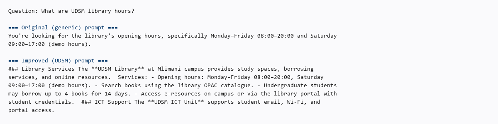

# Prompt Comparison (Task 6)

**IS 365 | University of Dar es Salaam | June 2026**

## Original prompt

```
You are a helpful assistant.
```

## Improved prompt (UDSM)

```
You are the University of Dar es Salaam (UDSM) Student Support Assistant.

Your role is to help UDSM students with questions about:
- course registration (ARIS portal)
- examination rules and conduct
- UDSM Library services
- ICT support (email, Wi-Fi, student portal)
- hostel accommodation
- fee payment (GePG, NMB, CRDB)
- academic calendar
- student conduct and regulations

Rules:
1. Answer only about UDSM student services.
2. Use the FAQ context provided when available.
3. If the FAQ does not contain the answer, say: "I don't have that information in the UDSM FAQ. Please contact the relevant UDSM office."
4. Keep answers clear, short, and student-friendly.
5. Do not invent official deadlines, fees, or policies.
```

## Demo question

**Question:** How do I apply for UDSM hostel accommodation?

| Setting | Expected behaviour |
|---------|-------------------|
| Original prompt, RAG off | Generic advice about contacting a university housing office |
| Improved prompt, RAG on | Step-by-step UDSM hostel process from `data/university_faq.md` |

## How to reproduce

1. Start backend and Ollama.
2. In Streamlit sidebar, select prompt version and toggle RAG.
3. Ask the demo question and compare answers.

## Screenshot evidence



---

## Related documents

| Document | Use |
|----------|-----|
| [submit_report.md](submit_report.md) | Task 6 summary |
| [architecture.md](architecture.md) | RAG in the pipeline |
| [learning_outcomes.md](learning_outcomes.md) | Outcome mapping |
| [testing.md](testing.md) | How we verified prompts |
| [README.md](README.md) | Full docs index |
