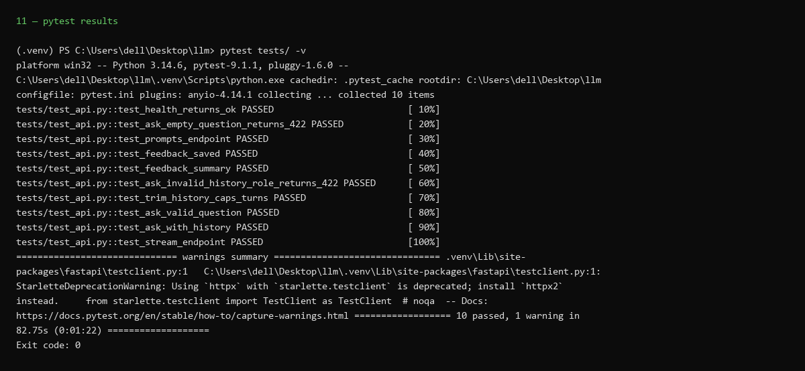
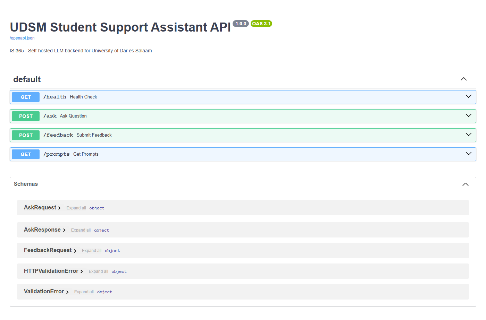
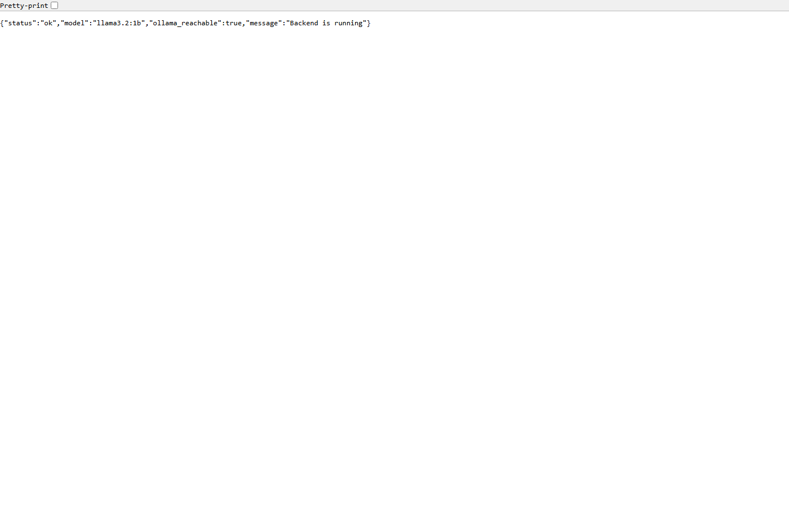
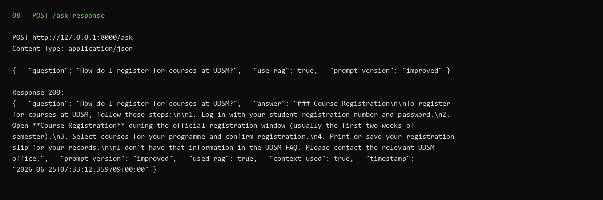
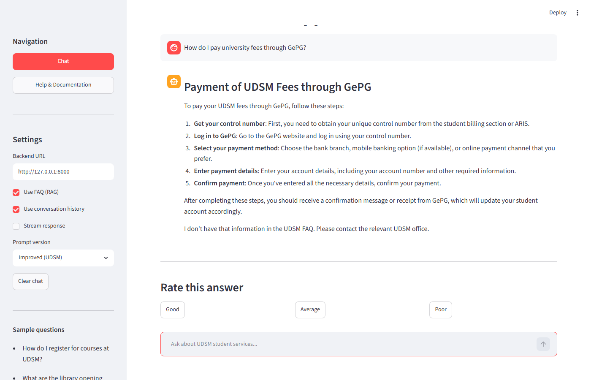

# API Testing Evidence

**IS 365 | University of Dar es Salaam | June 2026**

How we tested the FastAPI backend and end-to-end pipeline (Learning Outcome 6).

---

## Automated tests (pytest)

**Command:**

```powershell
pytest tests/ -v
```

**File:** `tests/test_api.py`

| Test | What it checks |
|------|----------------|
| `test_health_returns_ok` | `GET /health` responds |
| `test_ask_empty_question_returns_422` | Empty question rejected |
| `test_prompts_endpoint` | Prompt versions available |
| `test_feedback_saved` | Ratings saved to `feedback.jsonl` |
| `test_ask_valid_question` | Full `POST /ask` when Ollama is running |



---

## Manual tests (Swagger UI)

1. Start backend: `uvicorn backend.main:app --host 127.0.0.1 --port 8000`
2. Open `http://127.0.0.1:8000/docs`
3. Try `GET /health` and `POST /ask` with a sample question







---

## End-to-end test (Streamlit)

1. Start Ollama, backend, and frontend
2. Ask a UDSM question in the chat
3. Confirm answer appears and ratings work



---

## Related documents

| Document | Use |
|----------|-----|
| [learning_outcomes.md](learning_outcomes.md) | Outcome 6 mapping |
| [submit_report.md](submit_report.md) | Section 9 — Testing and results |
| [error_handling.md](error_handling.md) | Error case tests |
| [architecture.md](architecture.md) | API endpoints overview |
| [README.md](README.md) | Full docs index |
